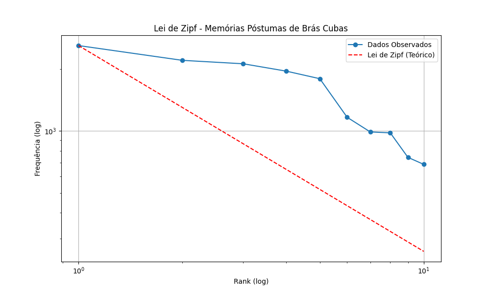

# Para ler Machado de Assis

Este notebook foi desenvolvido em continuação a um projeto inacabado, iniciado em 2011, que pode ser encontrado online no seguinte endereço: https://paralermachadodeassis.wordpress.com/.

Neste exemplo, utilizamos shell scripts para análise computacional da obra de Machado, disponível em http://machado.mec.gov.br, sob domínio público.

Embora [Luiz Amaral](https://github.com/luxedo) tenha publicado um [dataset](https://www.kaggle.com/datasets/luxedo/machado-de-assis), no kaggle, contendo as obras completas, realizamos o download diretamente na página do MEC.

O conjunto de utilitários apresentado como exemplo, denominado shell scripts, fornece ferramentas computacionais para processamento de linguagem natural e análise estatística, dentre outras, que podem ser utilizadas para explorar, agrupar, categorizar , sumarizar e extrair informações de textos não-estruturados.

Para aplicar o filtro de frequência de palavras, primeiro criamos um arquivo vazio para ser utilizado como argumento do executável criado para contagem de frequência de palavras, inclusive as stopwords - palavras comuns do idioma geralmente excluídas das tarefas de análise de texto ou processamento de linguagem natural. Em primeiro lugar, vamos considerar todo o vocabulário utilizado por Machado de Assis, sem distinção.

Depois criamos um arquivo shell executável, para automatizar tarefas repetitivas, que recebe três argumentos: o primeiro, o arquivo de entrada; o segundo, o filtro de stopwords; por fim, o terceiro define o parâmetro n ou mantém o padrão "10".

Então realizamos a contagem da frequência de palavras das obras completas de Machado de Assis, contando as stopwords, que encabeçam o ranking das mais utilizadas.

A seguir removemos as palavras mais comuns do idioma, denominadas stopwords, gravadas no arquivo stpw, que em geral exercem função sintagmática, isto é, atuam como conectores ou elementos estruturais na frase. Então listamos as 10 palavras mais frequentes na obra de Machado de Assis, em ordem decrescente, excluídas as stopwords.

Por fim, investigamos se a Lei de Zipf se aplica a uma obra específica de Machado de Assis:

O usuário poderá reproduzir os procedimentos no *Jupyter Lab*, na linha de comando do terminal Unix ou no Google Colab, ambiente que exigirá ajustes adicionais.

