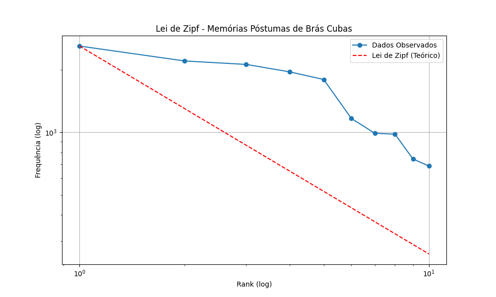

# Para ler Machado de Assis

### Introdução

Este notebook foi desenvolvido em continuação a um projeto inacabado, iniciado em 2011, que pode ser encontrado online no seguinte endereço: https://paralermachadodeassis.wordpress.com/.

Neste exemplo, utilizamos shell scripts para análise computacional da obra de Machado, disponível em http://machado.mec.gov.br, sob domínio público.

Embora [Luiz Amaral](https://github.com/luxedo) tenha publicado um [dataset](https://www.kaggle.com/datasets/luxedo/machado-de-assis), no kaggle, contendo as obras completas, realizamos o download diretamente na página do MEC.

O conjunto de utilitários apresentado como exemplo, denominado shell scripts, fornece ferramentas computacionais para processamento de linguagem natural e análise estatística, dentre outras, que podem ser utilizadas para explorar, agrupar, categorizar , sumarizar e extrair informações de textos não-estruturados.

Para aplicar o filtro de frequência de palavras, primeiro criamos um arquivo vazio para ser utilizado como argumento do executável criado para contagem de frequência de palavras, inclusive as *stopwords* - palavras comuns do idioma geralmente excluídas das tarefas de análise de texto ou processamento de linguagem natural. Em primeiro lugar, vamos considerar todo o vocabulário utilizado por Machado de Assis, sem distinção.

Depois criamos um arquivo shell executável, para automatizar tarefas repetitivas, que recebe três argumentos: o primeiro, o arquivo de entrada; o segundo, o filtro de stopwords; por fim, o terceiro define o parâmetro n ou mantém o padrão "10".

Então realizamos a contagem da frequência de palavras das obras completas de Machado de Assis, contando as stopwords, que encabeçam o ranking das mais utilizadas.

A seguir removemos as palavras mais comuns do idioma, denominadas *stopwords*, gravadas no arquivo *stpw*, que em geral exercem função sintagmática, isto é, atuam como conectores ou elementos estruturais na frase. Então listamos as 10 palavras mais frequentes na obra de Machado de Assis, em ordem decrescente, excluídas as *stopwords*.

Por fim, investigamos se a Lei de Zipf se aplica a uma obra específica de Machado de Assis:




### Coleta de dados

Criamos o arquivo .sh para baixar os arquivos

```bash
cat > download_machado.sh << 'EOF'
#!/bin/bash

# Pasta onde os arquivos serão baixados e convertidos
PASTA="Machado"
mkdir -p "$PASTA"
cd "$PASTA" || exit

# Arquivo único para o corpus completo
ARQUIVO_COMPLETO="machado_de_assis_completo.txt"
> "$ARQUIVO_COMPLETO"

# URL base da página com as obras de Machado de Assis
BASE_URL="https://machado.mec.gov.br/obra-completa-lista?start="

# Função para baixar e converter obras em PDF para texto
download_obras() {
    local url="$1"
    echo "Processando página: $url"

    # Baixa a página HTML
    local pagina=$(curl -s "$url")

    # Extrai os links de download dos PDFs
    local links=$(echo "$pagina" | grep -oP '/obra-completa-lista/item/download/[^"]+' | sort -u)

    # Contador para progresso
    local total=$(echo "$links" | wc -l)
    local contador=0

    [ -z "$links" ] && echo "Nenhum link encontrado nesta página." && return

    echo "Encontrados $total arquivos nesta página"

    for link in $links; do
        contador=$((contador+1))

        # Constrói o URL completo
        local full_url="https://machado.mec.gov.br$link"

        # Extrai o nome do arquivo a partir do URL
        local file_name=$(basename "$link" | cut -d'_' -f2-)
        file_name="${file_name%.*}.pdf"  # Garante extensão .pdf

        # Nome do arquivo de texto
        local txt_file_name="${file_name%.*}.txt"

        echo -e "\n[${contador}/${total}] Processando: $file_name"

        # Verifica se já existe um arquivo de texto correspondente
        if [ -f "$txt_file_name" ]; then
            echo "Arquivo de texto já existe. Pulando conversão."
        else
            # Verifica se o arquivo PDF já existe no diretório
            if [ ! -f "$file_name" ]; then
                # Faz o download do arquivo
                echo "Baixando: $full_url"
                curl -s -L -o "$file_name" "$full_url" || {
                    echo "Erro ao baixar $full_url"
                    continue
                }
            else
                echo "Arquivo PDF já existe. Pulando download."
            fi

            # Converte o arquivo PDF para texto
            if [ -f "$file_name" ]; then
                echo "Convertendo para texto..."
                pdftotext "$file_name" "$txt_file_name" || {
                    echo "Erro ao converter $file_name"
                    continue
                }

                # Remove o arquivo PDF original se a conversão foi bem-sucedida
                rm "$file_name"
                echo "Arquivo PDF removido."
            fi
        fi

        # Adiciona o conteúdo ao arquivo completo
        if [ -f "$txt_file_name" ]; then
            # Extrai o título da primeira linha
            local titulo=$(head -n 1 "$txt_file_name" | sed 's/^[ \t]*//;s/[ \t]*$//')

            # Se o título estiver vazio, usa o nome do arquivo
            if [ -z "$titulo" ]; then
                titulo="${file_name%.*}"
            fi

            echo "Adicionando: $titulo"
            echo "## $titulo" >> "$ARQUIVO_COMPLETO"
            echo "Arquivo: $txt_file_name" >> "$ARQUIVO_COMPLETO"
            echo "" >> "$ARQUIVO_COMPLETO"
            tail -n +2 "$txt_file_name" >> "$ARQUIVO_COMPLETO"
            echo -e "\n\n" >> "$ARQUIVO_COMPLETO"
        fi
    done
}

# Realiza o download das obras em todas as páginas
# Considerando 10 páginas com 12 itens cada
for start in $(seq 0 12 120); do
    url="${BASE_URL}${start}"
    download_obras "$url"
done

echo -e "\nProcessamento concluído. Arquivo completo salvo em: $PASTA/$ARQUIVO_COMPLETO"
EOF
```

### Tornamos o arquivo executável

```bash
chmod +x download_machado.sh
```

### Executamos o arquivo

```bash
./download_machado.sh
```

### Listamos os títulos baixados

```bash
ARQUIVO_COMPLETO=Machado/machado_de_assis_completo.txt
grep "^## " $ARQUIVO_COMPLETO | sort | uniq | sed 's/^## //'
echo "-----------------------------------------------------------------------"
grep "^## " $ARQUIVO_COMPLETO | sort | uniq | sed 's/^## //' | wc -l
```

```bash
A Constituinte perante a história, pelo sr. Homem de Mello. — Sombras e Luz, do sr. B.
A crítica teatral. José de Alencar : Mãe
A Estátua de José de Alencar
Alberto de Oliveira: Meridionais
Álvares de Azevedo: Lira dos vinte anos
A Mão e a Luva
Americanas
A morte de Francisco Otaviano
A nova geração
Ao Acaso
A Paixão de Jesus
Aquarelas
A Reforma pelo jornal
A semana
As Forcas Caudinas
Badaladas
Balas de Estalo
Bons Dias!
Carlos Jansen: Contos seletos das mil e uma noites
Carta ao Sr. Bispo do Rio de Janeiro
Carta à Redação da Imprensa Acadêmica
Cartas Fluminenses
Casa Velha
Castro Alves
Cenas da vida amazônica. por José Veríssimo.
Cherchez la femme
Comentários da semana
Compêndio da Gramática Portuguesa, por Vergueiro e Pertence. — À memória de
Contos Fluminenses
Crisálidas
Crítica teatral
Crônicas
Crônicas do Dr. Semana
Desencantos
Discursos na Academia Brasileira de Letras
Dois folhetins. Suplício de uma mulher
Dom Casmurro
Eça de Queirós
Eça de Queirós: O Primo Basílio
Eduardo Prado
Enéias Galvão: Miragens
Entre 1892 e 1894
Esaú e Jacó
Fagundes Varela
Fagundes Varela: Cantos e fantasias
Falenas
Flores e frutos. Poesias por Bruno Seabra, Garnier editor, 1862.
Francisco de Castro: Harmonias errantes
Garrett
Gazeta de Holanda
Gonçalves Dias
Helena
Henrique Chaves
Henrique Lombaerts
Henriqueta Renan
História de Quinze Dias
História dos trinta dias
Histórias da Meia-Noite
Histórias Sem Data
Hoje avental, amanhã luva
Iaiá Garcia
Idéias sobre o Teatro
J.M. de Macedo: O culto do dever
Joaquim Nabuco: Pensées détachées et souvenirs
Joaquim Serra
José de Alencar
José de Alencar: Iracema
José de Alencar: O Guarani
Junqueira Freire: Inspirações do claustro
Lição de Botânica
L. L. Fernandes Pinheiro Júnior: Tipos e quadros
Lúcio de Mendonça: Névoas matutinas
Magalhães de Azeredo: Horas sagradas; Mário de Alencar: Versos
Magalhães de Azeredo: Procelárias
Memorial de Aires
Memórias Póstumas de Brás Cubas
Não consultes médico
Notas semanais
Notícia da atual literatura brasileira. Instinto de nacionalidade
O Almada
O Bote de Rapé
O caminho da porta
Ocidentais
O futuro dos argentinos
O ideal do crítico
O jornal e o livro [1]
Oliveira Lima: Secretário D’El-Rei
Oliver Twist
O passado, o presente e o futuro da literatura
Os Deuses de casaca
Os imortais
Os Trabalhadores do Mar
O Velho Senado
O Visconde de Castilho
Páginas Recolhidas
Papéis Avulsos
Pareceres de Machado de Assis a diversas peças teatrais
Pedro Luís
Peregrinação pela província de S. Paulo. por A. E. Zaluar, 1863, Garnier, editor.
Poesias dispersas
Porto Alegre: Colombo
Propósito
Quase ministro
Queda que as mulheres têm para os tolos
Quincas Borba
Raimundo Correia: Sinfonias
Relíquias de Casa Velha
Ressurreição
Revelações. Poesias de A. E. Zaluar, Garnier editor, 1863.
Revista dos Teatros
Revista Dramática
Secretaria da Agricultura
Suplício de uma mulher
Tu, só tu, puro amor
Un cuento endemoniado e La mujer misteriosa. por Guilherme Malta. [1]
Várias Histórias
-----------------------------------------------------------------------
116
```

### Considerações finais

As obras completas foram salvas em um único arquivo texto denominado *machado_de_assis_completo.txt*.
O usuário poderá reproduzir os procedimentos no *Jupyter Lab*, na linha de comando do terminal Unix ou no Google Colab, ambiente que exigirá ajustes adicionais.


